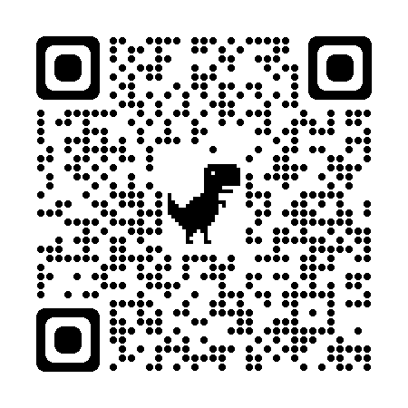

# AnalysisAVP

Audio and video knowledge collection.

## Stargazers over time

## Chapters and sections

- [x] [音视频基本原理](./音视频基本原理.md)
- [x] [音视频媒体格式](./音视频媒体格式.md)
- [x] [音视频框架](./音视频框架.md)
- [x] [流媒体协议](./流媒体协议.md)
- [x] [WebRTC](./webrtc/README.md)

## Reading recommendation

| title                                 | link                                                                                                                                                                                                                                                                                                                                                                                                                                             | reading-time      | remark |
| ------------------------------------- | ------------------------------------------------------------------------------------------------------------------------------------------------------------------------------------------------------------------------------------------------------------------------------------------------------------------------------------------------------------------------------------------------------------------------------------------------ | ----------------- | ------ |
| OpenGL ES 应用开发实践指南 Android 卷 | [pdf](https://github.com/gongluck/documents/blob/main/%E9%9F%B3%E8%A7%86%E9%A2%91/OpenGL%20ES%E5%BA%94%E7%94%A8%E5%BC%80%E5%8F%91%E5%AE%9E%E8%B7%B5%E6%8C%87%E5%8D%97%20%20Android%E5%8D%B7%20%5B%EF%BC%88%E7%BE%8E%EF%BC%89KevinBrothaler%E8%91%97%5D.pdf) [offcial](https://pragprog.com/titles/kbogla/opengl-es-2-for-android/) [example](https://github.com/gongluck/AnalysisAVP/tree/master/example/android/opengles/opengles-java) | from Sep 16, 2024 |        |

## Research record

| title                                | link                                               | time         | remark                                |
| ------------------------------------ | -------------------------------------------------- | ------------ | ------------------------------------- |
| 编译 Android 系统源码中 screencap    | [blog](https://gongluck.github.io/av/screencap)    | Sep 8, 2024  | 在用户层使用系统 so 编译 screencap    |
| 编译 Android 系统源码中 screenrecord | [blog](https://gongluck.github.io/av/screenrecord) | Sep 21, 2024 | 在用户层使用系统 so 编译 screenrecord |

## Example code

| title                                      | link                                        | time                             | remark                                                                             |
| ------------------------------------------ | ------------------------------------------- | -------------------------------- | ---------------------------------------------------------------------------------- |
| Android 摄像头采集、渲染、旋转、编码、封装 | [code](./example/android/camera/app-camera) | from Dec 6, 2024 to Dec 11, 2024 | 对自己几年前写的代码重构，尤其是摄像头画面正确旋转和显示做了重新设计，封装模块 API |

## QR Code

