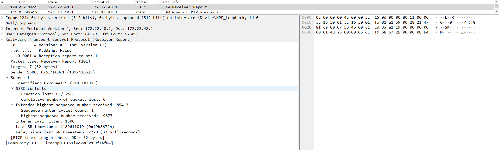

# RTP/RTCP

- [RTP/RTCP](#rtprtcp)
  - [RTP](#rtp)
    - [RTP Fixed Header](#rtp-fixed-header)
    - [RTP Header Extension](#rtp-header-extension)
      - [One-Byte Header](#one-byte-header)
      - [Two-Byte Header](#two-byte-header)
  - [RTCP](#rtcp)
    - [Sender Report](#sender-report)
    - [Receiver Report](#receiver-report)
    - [Source Description](#source-description)
    - [Feedback Message](#feedback-message)
      - [Feedback Message Header](#feedback-message-header)
      - [Feedback Control Information](#feedback-control-information)
        - [Generic NACK message](#generic-nack-message)
        - [Picture Loss Indication](#picture-loss-indication)
        - [Full Intra Request](#full-intra-request)
      - [Transport Feedback](#transport-feedback)
        - [Packet Chunk](#packet-chunk)
          - [Run Length Chunk](#run-length-chunk)
          - [Status Vector Chunk](#status-vector-chunk)
    - [Extended Reports](#extended-reports)
      - [Extended Reports Header](#extended-reports-header)
      - [Report Blocks](#report-blocks)
      - [Receiver Reference Time Report Block](#receiver-reference-time-report-block)
      - [DLRR Report Block](#dlrr-report-block)

## RTP

### RTP Fixed Header

```c++
  0                   1                   2                   3
  0 1 2 3 4 5 6 7 8 9 0 1 2 3 4 5 6 7 8 9 0 1 2 3 4 5 6 7 8 9 0 1
 +-+-+-+-+-+-+-+-+-+-+-+-+-+-+-+-+-+-+-+-+-+-+-+-+-+-+-+-+-+-+-+-+
 |V=2|P|X|  CC   |M|     PT      |       sequence number         |
 +-+-+-+-+-+-+-+-+-+-+-+-+-+-+-+-+-+-+-+-+-+-+-+-+-+-+-+-+-+-+-+-+
 |                           timestamp                           |
 +-+-+-+-+-+-+-+-+-+-+-+-+-+-+-+-+-+-+-+-+-+-+-+-+-+-+-+-+-+-+-+-+
 |           synchronization source (SSRC) identifier            |
 +=+=+=+=+=+=+=+=+=+=+=+=+=+=+=+=+=+=+=+=+=+=+=+=+=+=+=+=+=+=+=+=+
 |            contributing source (CSRC) identifiers             |
 |                             ....                              |
 +-+-+-+-+-+-+-+-+-+-+-+-+-+-+-+-+-+-+-+-+-+-+-+-+-+-+-+-+-+-+-+-+
```

- V：RTP 协议的版本号，占 2 位，当前协议版本号为 2。
- P：填充标志，占 1 位，如果 P=1，则在该报文的尾部填充一个或多个额外的八位组，它们不是有效载荷的一部分。
- X：扩展标志，占 1 位，如果 X=1，则在 RTP 报头后跟有一个扩展报头。
- CC：CSRC 计数器，占 4 位，指示 CSRC 标识符的个数。
- M: 标记，占 1 位，不同的有效载荷有不同的含义，对于视频，标记一帧的结束；对于音频，标记会话的开始。
- PT: 有效载荷类型，占 7 位，用于说明 RTP 报文中有效载荷的类型，如 GSM 音频、JPEM 图像等，在流媒体中大部分是用来区分音频流和视频流的，这样便于客户端进行解析。
- 序列号：占 16 位，用于标识发送者所发送的 RTP 报文的序列号，每发送一个报文，序列号增 1。这个字段当下层的承载协议用 UDP 的时候，网络状况不好的时候可以用来检查丢包。同时出现网络抖动的情况可以用来对数据进行重新排序，在 helix 服务器中这个字段是从 0 开始的，同时音频包和视频包的 sequence 是分别记数的。
- 时戳(Timestamp)：占 32 位，时戳反映了该 RTP 报文的第一个八位组的采样时刻。接收者使用时戳来计算延迟和延迟抖动，并进行同步控制。
- 同步信源(SSRC)标识符：占 32 位，用于标识同步信源。该标识符是随机选择的，用于唯一地标识一个实时媒体流。在 WebRTC 中，每个媒体流（例如音频或视频）都有一个唯一的 SSRC 值，用于区分不同的流。
- 特约信源(CSRC)标识符：每个 CSRC 标识符占 32 位，可以有 0 ～ 15 个。每个 CSRC 标识了包含在该 RTP 报文有效载荷中的所有特约信源，是在混音或合成多个音频流时使用的标识符。当多个音频流混合在一起时，每个音频流都会贡献一部分数据，CSRC 用于标识每个输入流的贡献者。

### RTP Header Extension

```c++
  0                   1                   2                   3
  0 1 2 3 4 5 6 7 8 9 0 1 2 3 4 5 6 7 8 9 0 1 2 3 4 5 6 7 8 9 0 1
 +-+-+-+-+-+-+-+-+-+-+-+-+-+-+-+-+-+-+-+-+-+-+-+-+-+-+-+-+-+-+-+-+
 |      defined by profile       |           length              |
 +-+-+-+-+-+-+-+-+-+-+-+-+-+-+-+-+-+-+-+-+-+-+-+-+-+-+-+-+-+-+-+-+
 |                        header extension                       |
 |                             ....                              |

```

- 若 RTP 固定头中的扩展比特位(X)置 1，则一个长度可变的头扩展部分被加到 RTP 固定头之后。
- RTP 固定头之后只允许有一个头扩展。为允许多个互操作实现独立生成不同的头扩展，或某种特定实现有多种不同的头扩展，扩展项的前 16 比特用以识别标识符或参数。这 16 比特的格式由具体实现的上层协议定义。
- defined by profile：决定使用哪种 Header Extension：one-byte 或者 two-byte header。
- length:表示 Header Extension 的长度：(length + 1) x 4 字节。

#### One-Byte Header

```c++
   0                   1                   2                   3
   0 1 2 3 4 5 6 7 8 9 0 1 2 3 4 5 6 7 8 9 0 1 2 3 4 5 6 7 8 9 0 1
  +-+-+-+-+-+-+-+-+-+-+-+-+-+-+-+-+-+-+-+-+-+-+-+-+-+-+-+-+-+-+-+-+
  |       0xBE    |    0xDE       |           length              |
  +-+-+-+-+-+-+-+-+-+-+-+-+-+-+-+-+-+-+-+-+-+-+-+-+-+-+-+-+-+-+-+-+
  |  ID   | len   |     data      |  pad...   |         ...
  +-+-+-+-+-+-+-+-+-+-+-+-+-+-+-+-+-+-+-+-+-+-+-+-+-+-+-+-+-+-+-+-+
```

- 对于 One-Byte Header，defined by profile 字段为固定的 0xBEDE。
- ID：4-bit 长度的 ID 表示本地标识符。
- len：表示 extension data 长度，范围：0~15，为 0 表示长度为 1 字节，15 表示 16 字节。

#### Two-Byte Header

```c++
   0                   1                   2                   3
   0 1 2 3 4 5 6 7 8 9 0 1 2 3 4 5 6 7 8 9 0 1 2 3 4 5 6 7 8 9 0 1
  +-+-+-+-+-+-+-+-+-+-+-+-+-+-+-+-+-+-+-+-+-+-+-+-+-+-+-+-+-+-+-+-+
  |         0x100         |appbits|           length              |
  +-+-+-+-+-+-+-+-+-+-+-+-+-+-+-+-+-+-+-+-+-+-+-+-+-+-+-+-+-+-+-+-+
  |      ID       |     len       |     data        |   pad...    |
  +-+-+-+-+-+-+-+-+-+-+-+-+-+-+-+-+-+-+-+-+-+-+-+-+-+-+-+-+-+-+-+-+
  |                              ...                              |
  +-+-+-+-+-+-+-+-+-+-+-+-+-+-+-+-+-+-+-+-+-+-+-+-+-+-+-+-+-+-+-+-+
```

- appbits：与应用程序相关，可定义为任何值或含义，0 忽略。
- ID：本地标识符。
- length：表示 extension data 长度，范围 1~255。

## RTCP

### Sender Report

```c++

        0                   1                   2                   3
        0 1 2 3 4 5 6 7 8 9 0 1 2 3 4 5 6 7 8 9 0 1 2 3 4 5 6 7 8 9 0 1
       +-+-+-+-+-+-+-+-+-+-+-+-+-+-+-+-+-+-+-+-+-+-+-+-+-+-+-+-+-+-+-+-+
header |V=2|P|    RC   |   PT=SR=200   |             length            |
       +-+-+-+-+-+-+-+-+-+-+-+-+-+-+-+-+-+-+-+-+-+-+-+-+-+-+-+-+-+-+-+-+
       |                         SSRC of sender                        |
       +=+=+=+=+=+=+=+=+=+=+=+=+=+=+=+=+=+=+=+=+=+=+=+=+=+=+=+=+=+=+=+=+
sender |              NTP timestamp, most significant word             |
info   +-+-+-+-+-+-+-+-+-+-+-+-+-+-+-+-+-+-+-+-+-+-+-+-+-+-+-+-+-+-+-+-+
       |             NTP timestamp, least significant word             |
       +-+-+-+-+-+-+-+-+-+-+-+-+-+-+-+-+-+-+-+-+-+-+-+-+-+-+-+-+-+-+-+-+
       |                         RTP timestamp                         |
       +-+-+-+-+-+-+-+-+-+-+-+-+-+-+-+-+-+-+-+-+-+-+-+-+-+-+-+-+-+-+-+-+
       |                     sender's packet count                     |
       +-+-+-+-+-+-+-+-+-+-+-+-+-+-+-+-+-+-+-+-+-+-+-+-+-+-+-+-+-+-+-+-+
       |                      sender's octet count                     |
       +=+=+=+=+=+=+=+=+=+=+=+=+=+=+=+=+=+=+=+=+=+=+=+=+=+=+=+=+=+=+=+=+
```

- NTP timestamp: 64bits。记录着发送该 SR 的 NTP 时间戳。

### Receiver Report

```c++

        0                   1                   2                   3
        0 1 2 3 4 5 6 7 8 9 0 1 2 3 4 5 6 7 8 9 0 1 2 3 4 5 6 7 8 9 0 1
       +-+-+-+-+-+-+-+-+-+-+-+-+-+-+-+-+-+-+-+-+-+-+-+-+-+-+-+-+-+-+-+-+
header |V=2|P|    RC   |   PT=RR=201   |             length            |
       +-+-+-+-+-+-+-+-+-+-+-+-+-+-+-+-+-+-+-+-+-+-+-+-+-+-+-+-+-+-+-+-+
       |                     SSRC of packet sender                     |
       +=+=+=+=+=+=+=+=+=+=+=+=+=+=+=+=+=+=+=+=+=+=+=+=+=+=+=+=+=+=+=+=+
report |                 SSRC_1 (SSRC of first source)                 |
block  +-+-+-+-+-+-+-+-+-+-+-+-+-+-+-+-+-+-+-+-+-+-+-+-+-+-+-+-+-+-+-+-+
  1    | fraction lost |       cumulative number of packets lost       |
       +-+-+-+-+-+-+-+-+-+-+-+-+-+-+-+-+-+-+-+-+-+-+-+-+-+-+-+-+-+-+-+-+
       |           extended highest sequence number received           |
       +-+-+-+-+-+-+-+-+-+-+-+-+-+-+-+-+-+-+-+-+-+-+-+-+-+-+-+-+-+-+-+-+
       |                      interarrival jitter                      |
       +-+-+-+-+-+-+-+-+-+-+-+-+-+-+-+-+-+-+-+-+-+-+-+-+-+-+-+-+-+-+-+-+
       |                         last SR (LSR)                         |
       +-+-+-+-+-+-+-+-+-+-+-+-+-+-+-+-+-+-+-+-+-+-+-+-+-+-+-+-+-+-+-+-+
       |                   delay since last SR (DLSR)                  |
       +=+=+=+=+=+=+=+=+=+=+=+=+=+=+=+=+=+=+=+=+=+=+=+=+=+=+=+=+=+=+=+=+
report |                 SSRC_2 (SSRC of second source)                |
block  +-+-+-+-+-+-+-+-+-+-+-+-+-+-+-+-+-+-+-+-+-+-+-+-+-+-+-+-+-+-+-+-+
  2    :                               ...                             :
       +=+=+=+=+=+=+=+=+=+=+=+=+=+=+=+=+=+=+=+=+=+=+=+=+=+=+=+=+=+=+=+=+
       |                  profile-specific extensions                  |
```

- RR 包
  
- RC(Reception report count): 占5位，表示接收者报告的数量。
- fraction lost: 自上次发送 RR 后 SSRC_n 的丢包率。`fraction lost = (cumulative_loss_ - last_report_cumulative_loss_) / (received_seq_max_ - last_report_seq_max_)`。
- cumulative number of packets lost: 24 bits，记录 SSRC_n 从开始到现在总共丢失的包。
- extended highest sequence number received: 32 bits，将序列号扩展为 32bit，用于标识当前收到的最大包序列号。
- last SR timestamp (LSR): 32 bits。64 位 NTP 时间戳中间的 32bit（NTP 时间戳指绝对时间，相对 1900 年 1 月 1 日 00:00:00 经历的时间，单位为秒。完整 NTP 时间戳用 64bits 表示，左半 32bits 表示整数，右半 32bits 表示小数，一般为了紧凑，取中间 32bits 表示即可，这时整数与小数分别 16bits 表示）。记录着上次源 SSRC_n 发送 SR 的 NTP 时间，从收到的 SR 记录的 NTP 时间戳获取。如果没有收到 SR，值为 0。
- delay since last SR (DLSR): 32 bits。以 1/65536（2<sup>16</sup>）秒为单位。记录着上次接收到源 SSRC_n 发送的 SR 到当前发送 RR 的间隔时间。如果没有收到 SR，值为 0。

### Source Description

```c++
            0                   1                   2                   3
            0 1 2 3 4 5 6 7 8 9 0 1 2 3 4 5 6 7 8 9 0 1 2 3 4 5 6 7 8 9 0 1
          +-+-+-+-+-+-+-+-+-+-+-+-+-+-+-+-+-+-+-+-+-+-+-+-+-+-+-+-+-+-+-+-+
    header |V=2|P|    SC   |  PT=SDES=202  |             length            |
          +=+=+=+=+=+=+=+=+=+=+=+=+=+=+=+=+=+=+=+=+=+=+=+=+=+=+=+=+=+=+=+=+
    chunk  |                          SSRC/CSRC_1                          |
      1    +-+-+-+-+-+-+-+-+-+-+-+-+-+-+-+-+-+-+-+-+-+-+-+-+-+-+-+-+-+-+-+-+
          |                           SDES items                          |
          |                              ...                              |
          +=+=+=+=+=+=+=+=+=+=+=+=+=+=+=+=+=+=+=+=+=+=+=+=+=+=+=+=+=+=+=+=+
    chunk  |                          SSRC/CSRC_2                          |
      2    +-+-+-+-+-+-+-+-+-+-+-+-+-+-+-+-+-+-+-+-+-+-+-+-+-+-+-+-+-+-+-+-+
          |                           SDES items                          |
          |                              ...                              |
          +=+=+=+=+=+=+=+=+=+=+=+=+=+=+=+=+=+=+=+=+=+=+=+=+=+=+=+=+=+=+=+=+
```

### Feedback Message

#### Feedback Message Header

```c++
  0                   1                   2                   3
  0 1 2 3 4 5 6 7 8 9 0 1 2 3 4 5 6 7 8 9 0 1 2 3 4 5 6 7 8 9 0 1
 +-+-+-+-+-+-+-+-+-+-+-+-+-+-+-+-+-+-+-+-+-+-+-+-+-+-+-+-+-+-+-+-+
 |V=2|P|   FMT   |       PT      |          length               |
 +-+-+-+-+-+-+-+-+-+-+-+-+-+-+-+-+-+-+-+-+-+-+-+-+-+-+-+-+-+-+-+-+
 |                  SSRC of packet sender                        |
 +-+-+-+-+-+-+-+-+-+-+-+-+-+-+-+-+-+-+-+-+-+-+-+-+-+-+-+-+-+-+-+-+
 |                  SSRC of media source                         |
 +-+-+-+-+-+-+-+-+-+-+-+-+-+-+-+-+-+-+-+-+-+-+-+-+-+-+-+-+-+-+-+-+
 :            Feedback Control Information (FCI)

Payload type (PT): 8 bits
  This is the RTCP packet type that identifies the packet as being
  an RTCP FB message.  Two values are defined by the IANA:

  Name   | Value | Brief Description
  ----------+-------+------------------------------------
  RTPFB  |  205  | Transport layer FB message
  PSFB   |  206  | Payload-specific FB message
```

#### Feedback Control Information

##### Generic NACK message

```c++
  The Generic NACK message is identified by PT=RTPFB and FMT=1.

    0                   1                   2                   3
    0 1 2 3 4 5 6 7 8 9 0 1 2 3 4 5 6 7 8 9 0 1 2 3 4 5 6 7 8 9 0 1
   +-+-+-+-+-+-+-+-+-+-+-+-+-+-+-+-+-+-+-+-+-+-+-+-+-+-+-+-+-+-+-+-+
   |            PID                |             BLP               |
   +-+-+-+-+-+-+-+-+-+-+-+-+-+-+-+-+-+-+-+-+-+-+-+-+-+-+-+-+-+-+-+-+
```

##### Picture Loss Indication

```c++

   0                   1                   2                   3
   0 1 2 3 4 5 6 7 8 9 0 1 2 3 4 5 6 7 8 9 0 1 2 3 4 5 6 7 8 9 0 1
  +-+-+-+-+-+-+-+-+-+-+-+-+-+-+-+-+-+-+-+-+-+-+-+-+-+-+-+-+-+-+-+-+
  |V=2|P|  FMT=1  |     PT=206    |          length               |
  +-+-+-+-+-+-+-+-+-+-+-+-+-+-+-+-+-+-+-+-+-+-+-+-+-+-+-+-+-+-+-+-+
  |                  SSRC of packet sender                        |
  +-+-+-+-+-+-+-+-+-+-+-+-+-+-+-+-+-+-+-+-+-+-+-+-+-+-+-+-+-+-+-+-+
  |             SSRC of media source (unused) = 0                 |
  +-+-+-+-+-+-+-+-+-+-+-+-+-+-+-+-+-+-+-+-+-+-+-+-+-+-+-+-+-+-+-+-+
```

- 对于 PLI，由于只需要通知发送关键帧，无需携带其他消息，所以 FCI 部分为空。
- 对于 FMT 规定为 1，PT 规定为 PSFB。

##### Full Intra Request

```c++

   0                   1                   2                   3
   0 1 2 3 4 5 6 7 8 9 0 1 2 3 4 5 6 7 8 9 0 1 2 3 4 5 6 7 8 9 0 1
  +-+-+-+-+-+-+-+-+-+-+-+-+-+-+-+-+-+-+-+-+-+-+-+-+-+-+-+-+-+-+-+-+
  |V=2|P|  FMT=4  |     PT=206    |          length               |
  +-+-+-+-+-+-+-+-+-+-+-+-+-+-+-+-+-+-+-+-+-+-+-+-+-+-+-+-+-+-+-+-+
  |                  SSRC of packet sender                        |
  +-+-+-+-+-+-+-+-+-+-+-+-+-+-+-+-+-+-+-+-+-+-+-+-+-+-+-+-+-+-+-+-+
  |             SSRC of media source (unused) = 0                 |
  +-+-+-+-+-+-+-+-+-+-+-+-+-+-+-+-+-+-+-+-+-+-+-+-+-+-+-+-+-+-+-+-+
  :            Feedback Control Information (FCI)                 :
  :                                                               :
// Full intra request (FIR) (RFC 5104).
// The Feedback Control Information (FCI) for the Full Intra Request
// consists of one or more FCI entries.
// FCI:
   0                   1                   2                   3
   0 1 2 3 4 5 6 7 8 9 0 1 2 3 4 5 6 7 8 9 0 1 2 3 4 5 6 7 8 9 0 1
  +-+-+-+-+-+-+-+-+-+-+-+-+-+-+-+-+-+-+-+-+-+-+-+-+-+-+-+-+-+-+-+-+
  |                              SSRC                             |
  +-+-+-+-+-+-+-+-+-+-+-+-+-+-+-+-+-+-+-+-+-+-+-+-+-+-+-+-+-+-+-+-+
  | Seq nr.       |    Reserved = 0                               |
  +-+-+-+-+-+-+-+-+-+-+-+-+-+-+-+-+-+-+-+-+-+-+-+-+-+-+-+-+-+-+-+-+
```

- FMT 规定为 4，PT 规定为 PSFB。
- 由于 FIR 可用于通知多个编码发送端（例如多点视频会议情况），所以用到了 FCI 部分，填充多个发送端的 ssrc 信息。
- PLI 消息是用于丢包情况下的通知，而 FIR 却不是，在有些非丢包情况下，FIR 就要用到。

#### Transport Feedback

```c++
     0                   1                   2                   3
     0 1 2 3 4 5 6 7 8 9 0 1 2 3 4 5 6 7 8 9 0 1 2 3 4 5 6 7 8 9 0 1
    +-+-+-+-+-+-+-+-+-+-+-+-+-+-+-+-+-+-+-+-+-+-+-+-+-+-+-+-+-+-+-+-+
    |V=2|P|  FMT=15 |    PT=205     |           length              |
    +-+-+-+-+-+-+-+-+-+-+-+-+-+-+-+-+-+-+-+-+-+-+-+-+-+-+-+-+-+-+-+-+
  0 |                     SSRC of packet sender                     |
    +-+-+-+-+-+-+-+-+-+-+-+-+-+-+-+-+-+-+-+-+-+-+-+-+-+-+-+-+-+-+-+-+
  4 |                      SSRC of media source                     |
    +-+-+-+-+-+-+-+-+-+-+-+-+-+-+-+-+-+-+-+-+-+-+-+-+-+-+-+-+-+-+-+-+
  8 |      base sequence number     |      packet status count      |
    +-+-+-+-+-+-+-+-+-+-+-+-+-+-+-+-+-+-+-+-+-+-+-+-+-+-+-+-+-+-+-+-+
 12 |                 reference time                | fb pkt. count |
    +-+-+-+-+-+-+-+-+-+-+-+-+-+-+-+-+-+-+-+-+-+-+-+-+-+-+-+-+-+-+-+-+
 16 |          packet chunk         |         packet chunk          |
    +-+-+-+-+-+-+-+-+-+-+-+-+-+-+-+-+-+-+-+-+-+-+-+-+-+-+-+-+-+-+-+-+
    .                                                               .
    .                                                               .
    +-+-+-+-+-+-+-+-+-+-+-+-+-+-+-+-+-+-+-+-+-+-+-+-+-+-+-+-+-+-+-+-+
    |         packet chunk          |  recv delta   |  recv delta   |
    +-+-+-+-+-+-+-+-+-+-+-+-+-+-+-+-+-+-+-+-+-+-+-+-+-+-+-+-+-+-+-+-+
    .                                                               .
    .                                                               .
    +-+-+-+-+-+-+-+-+-+-+-+-+-+-+-+-+-+-+-+-+-+-+-+-+-+-+-+-+-+-+-+-+
    |           recv delta          |  recv delta   | zero padding  |
    +-+-+-+-+-+-+-+-+-+-+-+-+-+-+-+-+-+-+-+-+-+-+-+-+-+-+-+-+-+-+-+-+
```

- FMT：5bits。Feedback message type(FMT)固定为 15。
- PT：8bits。由于属于传输层的 Feedback Messages，所以 payload type(PT)为 205。
- base sequence number：2 字节，TransportFeedback 包中记录的第一个 RTP 包的 transport sequence number，在反馈的各个 TransportFeedback RTCP 包中，这个字段不一定是递增的，也有可能比之前的 RTCP 包小。
- packet status count：2 字节，表示这个 TransportFeedback 包记录了多少个 RTP 包信息，这些 RTP 的 transport sequence number 以 base sequence number 为基准，比如记录的第一个 RTP 包的 transport sequence number 为 base sequence number，那么记录的第二个 RTP 包 transport sequence number 为 base sequence number+1。
- reference time：3 字节，表示参考时间，以 64ms 为单位，RTCP 包记录的 RTP 包到达时间信息以这个 reference time 为基准进行计算。
- feedback packet count：1 字节，用于计数发送的每个 TransportFeedback 包，相当于 RTCP 包的序列号。可用于检测 TransportFeedback 包的丢包情况。
- packet chunk：2 字节，记录 RTP 包的到达状态，记录的这些 RTP 包 transport sequence number 通过 base sequence number 计算得到。
- recv delta：8bits，对于 packet received 状态的包，也就是收到的 RTP 包，在 recv delta 列表中添加对应的的到达时间间隔信息，用于记录 RTP 包到达时间信息。通过前面的 reference time 以及 recv delta 信息，就可以得到 RTP 包到达时间。
  - 如果在 packet chunk 记录了一个 Packet received, small delta 状态的包，那么就会在 receive delta 列表中添加一个无符号 1 字节长度 receive delta，无符号 1 字节取值范围[0,255]，由于 Receive Delta 以 0.25ms 为单位，故此时 Receive Delta 取值范围[0, 63.75]ms。
  - 如果在 packet chunk 记录了一个 Packet received, large or negative delta 状态的包，那么就会在 receive delta 列表中添加一个有符号 2 字节长度的 receive delta，范围[-8192.0, 8191.75] ms。
  - 如果时间间隔超过了最大限制，那么就会构建一个新的 TransportFeedback RTCP 包，由于 reference time 长度为 3 字节，所以目前的包中 3 字节长度能够覆盖很大范围了。

##### Packet Chunk

###### Run Length Chunk

```c++
   0                   1
   0 1 2 3 4 5 6 7 8 9 0 1 2 3 4 5
  +-+-+-+-+-+-+-+-+-+-+-+-+-+-+-+-+
  |T| S |       Run Length        |
  +-+-+-+-+-+-+-+-+-+-+-+-+-+-+-+-+
```

- chunk type (T)：1 bit，值为 0。
- packet status symbol (S)：2 bits，标识包状态。
- run length (L)：13 bits，行程长度，标识有多少个连续包为相同状态。

###### Status Vector Chunk

```c++
  0                   1
  0 1 2 3 4 5 6 7 8 9 0 1 2 3 4 5
 +-+-+-+-+-+-+-+-+-+-+-+-+-+-+-+-+
 |T|S|       symbol list         |
 +-+-+-+-+-+-+-+-+-+-+-+-+-+-+-+-+
```

- chunk type (T)：1 bit，值为 1。
- symbol size(S)：1 bit，为 0 表示只包含 packet not received(0)以及 packet received(1)状态，每个状态使用 1bit 表示，这样后面 14bits 的 symbol list 能标识 14 个包的状态。为 1 表示使用 2bits 来标识包状态，这样 symbol list 中我们只能标识 7 个包的状态。
- symbol list：14 bits，标识一系列包的状态, 总共能标识 7 或 14 个包的状态。

### Extended Reports

#### Extended Reports Header

```c++
  0                   1                   2                   3
  0 1 2 3 4 5 6 7 8 9 0 1 2 3 4 5 6 7 8 9 0 1 2 3 4 5 6 7 8 9 0 1
 +-+-+-+-+-+-+-+-+-+-+-+-+-+-+-+-+-+-+-+-+-+-+-+-+-+-+-+-+-+-+-+-+
 |V=2|P|reserved |   PT=XR=207   |             length            |
 +-+-+-+-+-+-+-+-+-+-+-+-+-+-+-+-+-+-+-+-+-+-+-+-+-+-+-+-+-+-+-+-+
 |                              SSRC                             |
 +-+-+-+-+-+-+-+-+-+-+-+-+-+-+-+-+-+-+-+-+-+-+-+-+-+-+-+-+-+-+-+-+
 :                         report blocks                         :
 +-+-+-+-+-+-+-+-+-+-+-+-+-+-+-+-+-+-+-+-+-+-+-+-+-+-+-+-+-+-+-+-+
```

#### Report Blocks

```c++
  0                   1                   2                   3
  0 1 2 3 4 5 6 7 8 9 0 1 2 3 4 5 6 7 8 9 0 1 2 3 4 5 6 7 8 9 0 1
 +-+-+-+-+-+-+-+-+-+-+-+-+-+-+-+-+-+-+-+-+-+-+-+-+-+-+-+-+-+-+-+-+
 |      BT       | type-specific |         block length          |
 +-+-+-+-+-+-+-+-+-+-+-+-+-+-+-+-+-+-+-+-+-+-+-+-+-+-+-+-+-+-+-+-+
 :             type-specific block contents                      :
 +-+-+-+-+-+-+-+-+-+-+-+-+-+-+-+-+-+-+-+-+-+-+-+-+-+-+-+-+-+-+-+-+
```

#### Receiver Reference Time Report Block

```c++
  0                   1                   2                   3
  0 1 2 3 4 5 6 7 8 9 0 1 2 3 4 5 6 7 8 9 0 1 2 3 4 5 6 7 8 9 0 1
 +-+-+-+-+-+-+-+-+-+-+-+-+-+-+-+-+-+-+-+-+-+-+-+-+-+-+-+-+-+-+-+-+
 |     BT=4      |   reserved    |       block length = 2        |
 +-+-+-+-+-+-+-+-+-+-+-+-+-+-+-+-+-+-+-+-+-+-+-+-+-+-+-+-+-+-+-+-+
 |              NTP timestamp, most significant word             |
 +-+-+-+-+-+-+-+-+-+-+-+-+-+-+-+-+-+-+-+-+-+-+-+-+-+-+-+-+-+-+-+-+
 |             NTP timestamp, least significant word             |
 +-+-+-+-+-+-+-+-+-+-+-+-+-+-+-+-+-+-+-+-+-+-+-+-+-+-+-+-+-+-+-+-+
```

#### DLRR Report Block

```c++
  0                   1                   2                   3
  0 1 2 3 4 5 6 7 8 9 0 1 2 3 4 5 6 7 8 9 0 1 2 3 4 5 6 7 8 9 0 1
 +-+-+-+-+-+-+-+-+-+-+-+-+-+-+-+-+-+-+-+-+-+-+-+-+-+-+-+-+-+-+-+-+
 |     BT=5      |   reserved    |         block length          |
 +=+=+=+=+=+=+=+=+=+=+=+=+=+=+=+=+=+=+=+=+=+=+=+=+=+=+=+=+=+=+=+=+
 |                 SSRC_1 (SSRC of first receiver)               | sub-
 +-+-+-+-+-+-+-+-+-+-+-+-+-+-+-+-+-+-+-+-+-+-+-+-+-+-+-+-+-+-+-+-+ block
 |                         last RR (LRR)                         |   1
 +-+-+-+-+-+-+-+-+-+-+-+-+-+-+-+-+-+-+-+-+-+-+-+-+-+-+-+-+-+-+-+-+
 |                   delay since last RR (DLRR)                  |
 +=+=+=+=+=+=+=+=+=+=+=+=+=+=+=+=+=+=+=+=+=+=+=+=+=+=+=+=+=+=+=+=+
 |                 SSRC_2 (SSRC of second receiver)              | sub-
 +-+-+-+-+-+-+-+-+-+-+-+-+-+-+-+-+-+-+-+-+-+-+-+-+-+-+-+-+-+-+-+-+ block
 :                               ...                             :   2
 +=+=+=+=+=+=+=+=+=+=+=+=+=+=+=+=+=+=+=+=+=+=+=+=+=+=+=+=+=+=+=+=+
```

- last RR timestamp (LRR): 32 bits。记录着上次源 SSRC_n 发送 Receiver Reference Time Report Block 的 NTP 时间，从收到的 Receiver Reference Time Report Block 记录的 NTP 时间戳获取。如果没有收到，值为 0。
- delay since last RR (DLRR): 32 bits。以 1/65536（2^16）秒为单位。记录着上次接收到源 SSRC_n 发送的 Receiver Reference Time Report Block 到当前发送 DLRR Report Block 的间隔时间。如果没有收到 Receiver Reference Time Report Block，值为 0。
