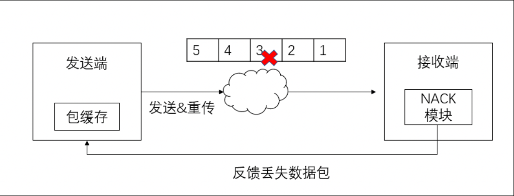

# Nack

- [Nack](#nack)
  - [概述](#概述)
  - [基本流程](#基本流程)
  - [核心思想](#核心思想)
    - [触发条件](#触发条件)
    - [重传限制](#重传限制)
    - [清理优化](#清理优化)
    - [请求关键帧机制](#请求关键帧机制)
  - [丢包检测](#丢包检测)
  - [清理策略](#清理策略)
  - [针对乱序优化重传策略](#针对乱序优化重传策略)

## 概述

- 在 WebRTC 中，NACK 是抵抗网络丢包非常重要的手段。
- 在 TCP 协议中，当接收端收到数据包时，会发送一个 ACK 给发送端，告诉已经收到了数据包。然而在 WebRTC 中，接收端会告诉发送端没有收到的数据包，所以称之为 NACK（negative acknowledge）。

## 基本流程

## 核心思想

### 触发条件

- 检测丢包发生时，会立即触发一次。
  - 针对乱序优化。
    - 等待一段时间再触发。
    - 统计方法估计乱序的个数 n，等待 n 个包再触发。
- 定期触发。
  - 两次重传的间隔设定，应超过一个 RTT。

### 重传限制

- 当网络质量非常差时，一直重传可能也不成功，不能无限重传下去。
- 一个包最多重传 10 次。
- 不重传时间过久的包，与最新的包 seq 相差 10000 以上的包不再重传。
- 同时重传总的包个数不超过 1000 个。

### 清理优化

- 考虑利用关键帧来清除未重传成功的包。
- 当收到完整连续的帧时，也可以清理。

### 请求关键帧机制

- 当大量重传无法成功时，可以放弃重传，直接请求 I 帧。

## 丢包检测

- 包序列号比较。

  - 如果视频流持续时间比较长，包序列号就很容易超过限制而从 0 开始循环。
  - WebRTC 里面提供了一个 webrtc::AheadOf(a, b)的方法来解决序号循环问题。基本思想是通过比较序列号的距离，来判断序列号是否发生了循环。
  - 即使存在丢包情况，只要设置一个足够大的安全距离，比如最大值的一半，就可以规避循环问题。

## 清理策略

- 对于时间比较久仍未重传成功的 seq_num，从 nack_list 中移除，与当前最新收到的 seq_num 相差 kMaxPacketAge=10000 的 seq_num 认为是时间比较久的 seq_num。
- 避免 nack_list 长度过大，当长度超过设定的限制 kMaxNackPackets=1000，执行清理动作。
- 利用 KeyFrame 来清理，清理到 I 帧的第一个包结束。

## 针对乱序优化重传策略

- 当判断需要重传时，等待一小段时间（可配置），再触发重传。
- 通过数据统计，估计一个合理的需要等待的包个数，再触发重传。
- 可能会加大延迟。
