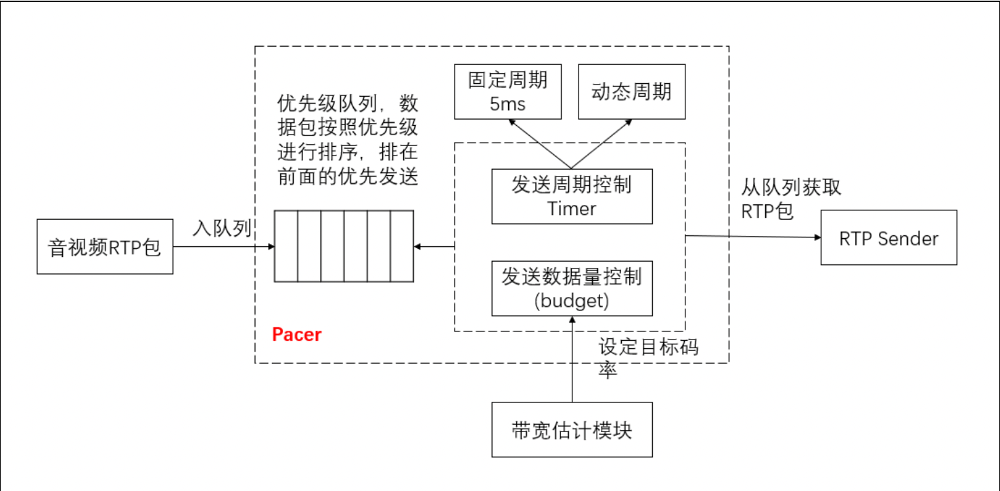

# Pacer

- [Pacer](#pacer)
  - [概述](#概述)
  - [基本流程](#基本流程)
  - [包优先级](#包优先级)
  - [优先级队列](#优先级队列)
  - [数据包发送预算](#数据包发送预算)
  - [Pacer 延迟优化](#pacer-延迟优化)

## 概述

- Paced Sender，也常常被称之为 Pacer，是 WebRTC 技术栈的一部分，主要用于平滑发送数据包流到网络。
- 媒体数据包先在缓冲区里面排队，然后使用一个漏桶算法将它们平缓的发送到网络上，这个缓冲区的设计很关键，需要考虑优先级，音频优先于视频，如果优先级相同的流，还需要能够轮询发送，以避免一个流阻塞了另外一个流。
- Pacer 还有一个作用，比如在需要最小发送速率的情况下，可以发送填充数据包。

## 基本流程

## 包优先级

- 音频包 > 重传包 > 视频包 = FEC 包 > padding(填充包)。
- 人对声音更敏感，优先发送音频。
- 为了尽可能的恢复丢包，降低卡顿，重传包优先级提高。
- Padding 只是为了保持较高的带宽估计值，所以优先级可以很低。

## 优先级队列

- 数据是按照时间片（动态和静态）定量发送的，一次可能无法全部发送所有的数据，所以需要缓存数据，同时需要优先发送最重要的数据，因此需要一个优先级队列。
- 每个流分别维护一个优先级队列，其中每个流以 SSRC 为唯一标识。
- 流同样有优先级，以优先级队列中的 RTP 包的最高优先级作为流的优先级，优先级高的流将被优先发送，如果两个流的优先级相同，则累计发送数据量少的流优先发送，可以保证在多个流之间交替发送。
- 必须考虑大码率流和小码率流的情况，避免小流阻塞大流的发送，通过控制两个流之间累计发送的字节数的最大差值来避免这种问题。

## 数据包发送预算

- 周期性调度发送之后，会计算当前时间和上一次处理时间的时间差，根据这个流逝的时间，以及当前发送的目标码率，计算出当前时间片可以发送的数据量，然后从优先级队列中获取数据包进行发送。
- 每发送一个数据包，会消耗数据包大小的预算值，当预算值小于等于 0 之后，停止发送，等待下一次调度。

## Pacer 延迟优化

- Pacer 的策略是先将数据包缓存到队列，然后定时按量发送，当估计的带宽较小时，每次发送的数据量不多，但是需要发送的数据量又比较大，此时可能会导致数据包在队列中积压，从而引起延迟。
- 设定一个期望的延迟时间，同时计算队列中数据包的平均排队时间。
